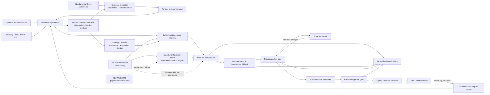

# Financial Independence Digital Twin

An evidence-grounded advisor decision platform that combines a Financial Independence Digital Twin with a fiduciary operating layer. It turns household facts and financial events into deterministic scenario comparisons, citation-linked recommendation drafts, policy checks, and a human-approved audit trail.

This is a production-shaped demonstration, not financial advice. The included Patel household, employer, securities, and account data are entirely synthetic.

## Why this project is different

- Financial calculations are deterministic TypeScript—not LLM-generated math.
- Rental, portfolio, debt-paydown, fee, conflict, and FI outcomes use the same versioned assumptions.
- One shared decision-capital constraint is enforced across every alternative; infeasible strategies cannot be recommended or approved.
- The Decision Lab calculates deterministic mortgage/rent crossover boundaries, capital feasibility, and a 3 × 3 sensitivity surface.
- The Advisor Workbench provides a session-only, non-destructive what-if space that reuses the same deterministic engines without creating an audit record; selected economics can then be promoted into governed review.
- Resilience Mode applies explicit household shocks—income interruption, emergency spending, employer-stock decline, market drawdown, and spending inflation—to a transparent six-control Household Optionality Score.
- The score measures whether signed liquidity, credit-free runway, concentration, and decision-option floors survive. It is not NerdWallet's population-level Financial Resilience Index; dated FRI observations appear only as external context.
- A versioned Client Constitution turns liquidity, concentration, workload, FI-age, and modeled-success preferences into executable controls.
- A recommendation statement is labeled as client fact, calculation, external fact, assumption, advisor judgment, or AI suggestion.
- Public data has a source URL, observation date, retrieval date, and staleness state.
- Evidence-to-Twin intake content-hashes synthetic structured statements, extracts only allowlisted fields, and holds every proposed fact outside the twin until an advisor confirms it.
- Confirmed facts supersede prior field-level evidence, update the canonical twin with document provenance, and create separate evidence-admission and twin-update events in the audit chain.
- The Advisor Opportunity Radar continuously ranks deadlines, capital at stake, Client Constitution breaches, evidence readiness, and Decision Passport impact with deterministic, reconstructable rules.
- A blocked opportunity links directly to the missing evidence; an evidence-ready RSU opportunity enters Strategy Compiler.
- Strategy Compiler deterministically enumerates five bounded RSU actions, tests the signed Client Constitution, calculates advisor-economics differences, rejects breaches, and identifies a Pareto frontier without using AI to generate strategies or choose a winner.
- An advisor may focus one eligible candidate, but the server promotes the complete locked eligible bundle into Decision Lab and rejects any client-side drift from the stored compilation.
- The policy engine blocks guarantees, broken evidence, stale cited public facts, missing alternatives, and undisclosed conflicts.
- The API rejects approval unless the stored policy result is `APPROVE` and the advisor attests.
- Failed drafts can be regenerated with stored compliance feedback or replaced by the governed deterministic fallback.
- Every approval remains a human action; the database stores it in an append-only SHA-256 hash chain that the API recomputes on every audit read.
- Every approved recommendation receives an immutable HMAC-signed Decision Passport with its evidence, calculations, conflicts, constitution, and validity envelope.
- A six-hour monitor rechecks public-data retrieval, household constraints, and counterfactual boundaries. Material breaches invalidate advice permanently until a new reviewed passport is issued.
- The app remains functional without an LLM key by using a deterministic recommendation template.

## Product workflow



## Stack

- React 19, TypeScript, Vite, React Router
- Cloudflare Worker with Hono
- D1 for application/audit data, KV for cache and rate limits
- R2 and Vectorize planned for future binary-document storage and governed retrieval; the current structured evidence slice uses D1
- OpenRouter-compatible recommendation orchestration with production ZDR enforcement
- Vitest, fast-check, ESLint, Prettier, GitHub Actions

The production deployment is one Worker: `/api/*` runs the Hono API and Cloudflare static assets serve the SPA. This works on `workers.dev` without a custom domain.

## Run locally

Requirements: Node.js 22+ and npm.

```bash
npm install
npm run db:migrate:local
npm run db:seed:local
npm run dev
```

Open `http://localhost:8787`. Vite also runs on `http://localhost:5173` and proxies `/api` to the Worker.

The Worker auto-inserts the canonical synthetic household on the first API request. The SQL seed records the seed version; the TypeScript seed remains the single source of truth.

## Optional OpenRouter setup

Copy the example secrets file and add your server-side key:

```bash
cp services/api/.dev.vars.example services/api/.dev.vars
```

Never expose `OPENROUTER_API_KEY` through `VITE_*`, browser code, logs, or committed files. Without the key, recommendation drafting uses the tested deterministic fallback. With a key, the Worker validates model output against a strict Zod contract and falls back safely on provider, JSON, or schema failure.

`APP_ENV=demo` contains synthetic data only and may route to a free provider with provider data collection denied but without a ZDR endpoint requirement. Every other environment enforces ZDR. Never place real client data in demo mode.

## Verification

```bash
npm run verify
```

Individual commands:

```bash
npm run format:check
npm run lint
npm run typecheck
npm test
npm run test:coverage
npm run audit:production
npm run build
```

The sample API payload is at [`examples/scenario-request.json`](examples/scenario-request.json).

## Deploy to Cloudflare

1. Create a D1 database and KV namespace. R2 and Vectorize are not required for the current synthetic structured evidence workflow.
2. Replace the placeholder IDs/names in `services/api/wrangler.jsonc`.
3. Apply remote migrations:

   ```bash
   cd services/api
   npx wrangler d1 migrations apply FIDT_DB --remote
   ```

4. Add secrets:

   ```bash
   npx wrangler secret put OPENROUTER_API_KEY
   npx wrangler secret put PASSPORT_SIGNING_SECRET
   npx wrangler secret put CF_ACCESS_AUD
   npx wrangler secret put CF_ACCESS_TEAM_DOMAIN
   ```

5. Set `APP_ENV` to `production`, configure Cloudflare Access, update `APP_PUBLIC_URL`, then run:

   ```bash
   npm run deploy
   ```

Cloudflare free-tier limits and product pricing change; confirm current limits before launch. D1, KV, and third-party model usage can become billable beyond their included quotas.

## AWS migration path

The domain, contracts, policy, and orchestration packages have no Cloudflare persistence dependency. To migrate:

- replace the D1 repository with PostgreSQL/Aurora;
- replace KV with ElastiCache or DynamoDB TTL records;
- replace R2 with S3 and Vectorize with OpenSearch/pgvector;
- run the Hono handler in Lambda or ECS;
- replace Cloudflare Access middleware with Cognito or the organization’s OIDC provider.

Keep the API contracts and deterministic packages unchanged. See [`docs/architecture.md`](docs/architecture.md) and the ADRs for boundaries.

## Current boundaries

Included: synthetic household planning, allowlisted structured-document extraction, advisor-confirmed Evidence-to-Twin updates, field-level provenance, a deterministic Advisor Opportunity Radar, an RSU Strategy Compiler with constitution rejection, Pareto-frontier analysis and advisor-economics visibility, a session-only Advisor Workbench, deterministic household stress testing and optionality scoring, server-locked governed scenario promotion, shared-capital enforcement, executable client constraints, deterministic counterfactual boundaries, FI projection, rental underwriting, seeded portfolio simulations, debt comparison, fee conflicts, live public observations, governed recommendations, human review, signed Decision Passports, scheduled validity monitoring, automatic invalidation, and audit lineage.

Not included: personal-document upload, binary storage, document OCR, malware scanning, brokerage connectivity, trading, individualized tax/legal advice, multi-tenant billing, custodian write access, or production RIA books and records certification.

## Documentation

- [`docs/architecture.md`](docs/architecture.md)
- [`docs/data-governance.md`](docs/data-governance.md)
- [`docs/threat-model.md`](docs/threat-model.md)
- [`docs/security-advisories.md`](docs/security-advisories.md)
- [`docs/adr/001-deterministic-financial-core.md`](docs/adr/001-deterministic-financial-core.md)
- [`docs/adr/002-cloudflare-portability.md`](docs/adr/002-cloudflare-portability.md)
- [`docs/adr/003-governed-language-model.md`](docs/adr/003-governed-language-model.md)
- [`docs/adr/004-live-decision-passport.md`](docs/adr/004-live-decision-passport.md)
- [`docs/adr/005-household-optionality-score.md`](docs/adr/005-household-optionality-score.md)

## License

MIT. See [`LICENSE`](LICENSE).
