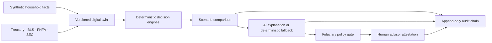

# Financial Independence Digital Twin

An evidence-grounded advisor decision platform that combines a Financial Independence Digital Twin with a fiduciary operating layer. It turns household facts and financial events into deterministic scenario comparisons, citation-linked recommendation drafts, policy checks, and a human-approved audit trail.

This is a production-shaped demonstration, not financial advice. The included Patel household, employer, securities, and account data are entirely synthetic.

## Why this project is different

- Financial calculations are deterministic TypeScript—not LLM-generated math.
- Rental, portfolio, debt-paydown, fee, conflict, and FI outcomes use the same versioned assumptions.
- A recommendation statement is labeled as client fact, calculation, external fact, assumption, advisor judgment, or AI suggestion.
- Public data has a source URL, observation date, retrieval date, and staleness state.
- The policy engine blocks guarantees, broken evidence, stale cited public facts, missing alternatives, and undisclosed conflicts.
- Every approval remains a human action; the database stores it in an append-only SHA-256 hash chain.
- The app remains functional without an LLM key by using a deterministic recommendation template.

## Product workflow



## Stack

- React 19, TypeScript, Vite, React Router
- Cloudflare Worker with Hono
- D1 for application/audit data, KV for cache and rate limits
- R2 and Vectorize planned for the future evidence-document phase
- OpenRouter-compatible recommendation orchestration with zero-data-retention routing requested
- Vitest, fast-check, ESLint, Prettier, GitHub Actions

The production deployment is one Worker: `/api/*` runs the Hono API and Cloudflare static assets serve the SPA. This works on `workers.dev` without a custom domain.

## Run locally

Requirements: Node.js 22+ and npm.

```bash
npm install
npm run db:migrate:local
npm run db:seed:local
npm run dev
```

Open `http://localhost:8787`. Vite also runs on `http://localhost:5173` and proxies `/api` to the Worker.

The Worker auto-inserts the canonical synthetic household on the first API request. The SQL seed records the seed version; the TypeScript seed remains the single source of truth.

## Optional OpenRouter setup

Copy the example secrets file and add your server-side key:

```bash
cp services/api/.dev.vars.example services/api/.dev.vars
```

Never expose `OPENROUTER_API_KEY` through `VITE_*`, browser code, logs, or committed files. Without the key, recommendation drafting uses the tested deterministic fallback. With a key, the Worker validates model output against a strict Zod contract and falls back safely on provider, JSON, or schema failure.

## Verification

```bash
npm run verify
```

Individual commands:

```bash
npm run format:check
npm run lint
npm run typecheck
npm test
npm run test:coverage
npm run audit:production
npm run build
```

The sample API payload is at [`examples/scenario-request.json`](examples/scenario-request.json).

## Deploy to Cloudflare

1. Create a D1 database and KV namespace. R2 and Vectorize are not required until the future evidence-document phase.
2. Replace the placeholder IDs/names in `services/api/wrangler.jsonc`.
3. Apply remote migrations:

   ```bash
   cd services/api
   npx wrangler d1 migrations apply FIDT_DB --remote
   ```

4. Add secrets:

   ```bash
   npx wrangler secret put OPENROUTER_API_KEY
   npx wrangler secret put CF_ACCESS_AUD
   npx wrangler secret put CF_ACCESS_TEAM_DOMAIN
   ```

5. Set `APP_ENV` to `production`, configure Cloudflare Access, update `APP_PUBLIC_URL`, then run:

   ```bash
   npm run deploy
   ```

Cloudflare free-tier limits and product pricing change; confirm current limits before launch. D1, KV, and third-party model usage can become billable beyond their included quotas.

## AWS migration path

The domain, contracts, policy, and orchestration packages have no Cloudflare persistence dependency. To migrate:

- replace the D1 repository with PostgreSQL/Aurora;
- replace KV with ElastiCache or DynamoDB TTL records;
- replace R2 with S3 and Vectorize with OpenSearch/pgvector;
- run the Hono handler in Lambda or ECS;
- replace Cloudflare Access middleware with Cognito or the organization’s OIDC provider.

Keep the API contracts and deterministic packages unchanged. See [`docs/architecture.md`](docs/architecture.md) and the ADRs for boundaries.

## Current boundaries

Included: synthetic household planning, FI projection, rental underwriting, seeded portfolio simulations, debt comparison, fee conflicts, live public observations, governed recommendations, human review, and audit lineage.

Not included: brokerage connectivity, trading, individualized tax/legal advice, document OCR, multi-tenant billing, custodian write access, or production RIA books and records certification.

## Documentation

- [`docs/architecture.md`](docs/architecture.md)
- [`docs/data-governance.md`](docs/data-governance.md)
- [`docs/threat-model.md`](docs/threat-model.md)
- [`docs/security-advisories.md`](docs/security-advisories.md)
- [`docs/adr/001-deterministic-financial-core.md`](docs/adr/001-deterministic-financial-core.md)
- [`docs/adr/002-cloudflare-portability.md`](docs/adr/002-cloudflare-portability.md)
- [`docs/adr/003-governed-language-model.md`](docs/adr/003-governed-language-model.md)

## License

MIT. See [`LICENSE`](LICENSE).
