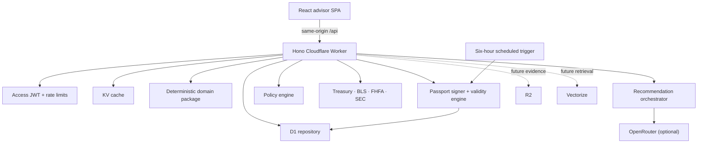

# Architecture

## Runtime view

## Package boundaries

| Package                 | Owns                                                                                                                                      | Must not own                             |
| ----------------------- | ----------------------------------------------------------------------------------------------------------------------------------------- | ---------------------------------------- |
| `@fidt/domain`          | Money math, FI, rental, portfolio simulation, shared capital, counterfactual boundaries, fees, conflicts, scenario engine, synthetic demo | HTTP, D1, prompts                        |
| `@fidt/contracts`       | API and model Zod schemas, response types                                                                                                 | Business calculations                    |
| `@fidt/ai-orchestrator` | Model provider, structured drafting, deterministic fallback                                                                               | Calculating or changing financial values |
| `@fidt/policy-engine`   | Evidence, language, conflict, alternative, freshness checks                                                                               | Generating recommendations               |
| `@fidt/api`             | Auth, routes, repositories, public adapters, audit                                                                                        | UI presentation                          |
| `@fidt/web`             | Advisor workflow and accessible presentation                                                                                              | Secrets or financial calculations        |

## Key request sequence

1. The API validates strategy inputs with Zod.
2. The domain package runs all strategies under one immutable assumption object and seed.
3. The API calculates potential advisor-revenue differences and persists the run.
4. The recommendation orchestrator sees selected household fields, scenario outputs, allowed citations, and conflicts.
5. Model output must satisfy the recommendation schema; otherwise the deterministic fallback is used.
6. The policy engine independently evaluates the draft.
7. A human must attest before approval is stored.
8. Approval issues an immutable passport whose canonical payload is hashed and signed server-side.
9. A scheduled monitor evaluates the passport envelope against refreshed data and current household facts.
10. Scenario, model, passport, monitor, and human actions append to the hash-chained audit table.

## Persistence

D1 stores a snapshot JSON for fast reconstruction plus normalized tables for future ingestion. Monetary columns in normalized tables use integer cents. Scenario outputs, Client Constitutions, prompts metadata, compliance decisions, Decision Passport payloads, validity checks, and audit metadata are immutable JSON snapshots. Passport status is mutable only through the monitor; invalidation is one-way and every status transition is audited.

The audit table has triggers that reject update and delete. Each event hashes its canonical content and the previous event hash. In a higher-assurance deployment, export daily chain heads to immutable object storage or an external timestamp service.

## Failure behavior

- Public source unavailable: connector reports `UNAVAILABLE`; existing cached observations may be used and retain dates.
- OpenRouter unavailable/invalid: deterministic fallback creates a reviewable draft.
- Policy failure: recommendation is stored with `REQUIRE_CHANGES`; approval is disabled in the UI.
- Capital-infeasible recommendation: policy returns a blocking result even if a model selects it.
- Passport condition unavailable: status becomes `REVIEW_REQUIRED`; a failed material condition becomes permanently `INVALIDATED`.
- Passport signature mismatch: verification fails and the passport must not be relied upon.
- Missing auth in production: request returns 401 before repository access.
- Invalid input: request returns a 422 with structured schema issues.
