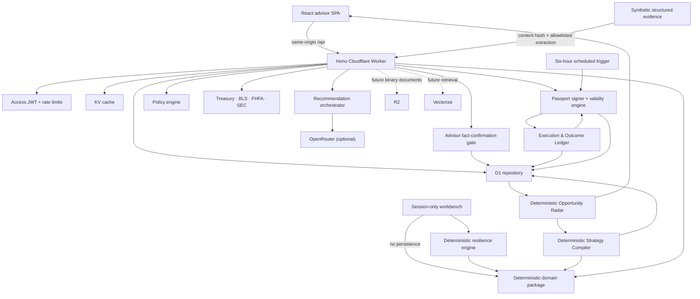

# Architecture

## Runtime view

## Package boundaries

| Package                 | Owns                                                                                                                                                             | Must not own                             |
| ----------------------- | ---------------------------------------------------------------------------------------------------------------------------------------------------------------- | ---------------------------------------- |
| `@fidt/domain`          | Money math, FI, rental, portfolio simulation, shared capital, household optionality, counterfactual boundaries, fees, conflicts, scenario engine, synthetic demo | HTTP, D1, prompts                        |
| `@fidt/contracts`       | API and model Zod schemas, response types                                                                                                                        | Business calculations                    |
| `@fidt/ai-orchestrator` | Model provider, structured drafting, deterministic fallback                                                                                                      | Calculating or changing financial values |
| `@fidt/policy-engine`   | Evidence, language, conflict, alternative, freshness checks                                                                                                      | Generating recommendations               |
| `@fidt/api`             | Auth, routes, repositories, public adapters, audit                                                                                                               | UI presentation                          |
| `@fidt/web`             | Advisor workflow and accessible presentation                                                                                                                     | Secrets or financial calculations        |

## Key request sequence

1. Evidence-to-Twin intake hashes a synthetic structured statement and extracts only document-type-specific, allowlisted fields. The LLM is not called.
2. Proposed facts remain outside the canonical household until the advisor selects them, records a rationale, and confirms them through the server-side admission gate.
3. Confirmation supersedes prior field evidence, updates the snapshot with document provenance, and appends separate evidence-confirmation and twin-update audit events.
4. The Opportunity Radar reconstructs priority from the current twin, deadline, capital at stake, Client Constitution, admitted evidence, and latest Decision Passport state. The score controls queue order only.
5. The Advisor Workbench can run the same deterministic engines against cloned household facts and session-only constraints. It does not persist results or append audit events.
6. Resilience Mode clones the household, applies a validated shock, calculates six weighted controls, and reports which uses of decision capital remain feasible. No LLM participates in the score.
7. An evidence-ready RSU opportunity enters Strategy Compiler. Versioned templates enumerate five bounded allocations; the deterministic domain engine calculates outcomes and the compiler tests every candidate against the signed Client Constitution.
8. Constitution-breaching candidates are rejected. Eligible candidates receive advisor-economics deltas and deterministic Pareto-dominance labels. The compiler does not generate strategies with AI and does not select or recommend a winner.
9. An advisor may focus one eligible candidate for review, but all eligible alternatives are promoted together. The API reloads the stored compilation and rejects changed capital, strategies, household, or triggering event.
10. Promoting a workbench scenario transfers its event and economic inputs into the governed Decision Lab; the signed Client Constitution is restored.
11. The API validates governed strategy and stress inputs with Zod and rejects decision capital greater than the stress-preserved amount.
12. The domain package runs all strategies under one immutable assumption object and seed.
13. The API calculates potential advisor-revenue differences and persists the governed run, compilation lineage, optionality assessment, and shock inputs.
14. The recommendation orchestrator sees selected household fields, scenario outputs, optionality output, allowed citations, and conflicts.
15. Model output must satisfy the recommendation schema; otherwise the deterministic fallback is used.
16. The policy engine independently evaluates the draft and treats signed resilience-floor breaches as blocking.
17. A human must attest before approval is stored.
18. Approval issues an immutable passport whose canonical payload—including resilience output—is hashed and signed server-side.
19. A verified valid passport creates an immutable execution-plan definition. Server-side prerequisite gates control which task may accept the next evidence receipt.
20. Task receipts are append-only and contain an external reference, evidence class, named recorder, timestamp, result, and attestation. FiduciaryOS never sends a trade, transfer, or custodian instruction.
21. The final task reconciles every expected outcome against a structured observed value and a deterministic tolerance. A signed validity-envelope breach invalidates the passport; other material deviations require renewed review.
22. A scheduled monitor reevaluates scenario and resilience conditions against refreshed data and current household facts.
23. Evidence, compilation, scenario, model, passport, execution, outcome, monitor, and human actions append to the hash-chained audit table.

## Persistence

D1 stores a snapshot JSON for fast reconstruction plus normalized evidence-document, extraction, source-fact, strategy-compilation, execution-plan, receipt, and reconciliation records. Structured demo source text is retained only to demonstrate deterministic extraction; production binary documents require encrypted object storage, malware scanning, access control, and retention policy. Monetary columns in normalized financial tables use integer cents. Compiled candidate sets, scenario outputs, Client Constitutions, prompts metadata, compliance decisions, Decision Passport payloads, execution definitions, receipts, reconciliations, validity checks, and audit metadata are immutable JSON snapshots. Scenario runs retain the compilation id when promoted from the compiler. Passport status changes only through monitored or execution-derived controls; invalidation is one-way and every status transition is audited.

The audit table has triggers that reject update and delete. Each event hashes its canonical content and the previous event hash. In a higher-assurance deployment, export daily chain heads to immutable object storage or an external timestamp service.

## Failure behavior

- Public source unavailable: connector reports `UNAVAILABLE`; existing cached observations may be used and retain dates.
- OpenRouter unavailable/invalid: deterministic fallback creates a reviewable draft.
- Policy failure: recommendation is stored with `REQUIRE_CHANGES`; approval is disabled in the UI.
- Capital-infeasible recommendation: policy returns a blocking result even if a model selects it.
- Resilience-floor breach: policy blocks approval; the advisor may revise the shock/strategy but cannot waive the stored Client Constitution silently.
- Passport condition unavailable: status becomes `REVIEW_REQUIRED`; a failed material condition becomes permanently `INVALIDATED`.
- Passport signature mismatch: verification fails and the passport must not be relied upon.
- Missing auth in production: request returns 401 before repository access.
- Invalid input: request returns a 422 with structured schema issues.
- Unsupported evidence field: extraction returns 422 and nothing is persisted.
- Unconfirmed evidence: facts remain proposed and cannot affect calculations or Radar readiness.
- Duplicate evidence review: the server returns 409 and does not replay a twin update.
- Unconfirmed RSU evidence: compilation is rejected before any strategy is created.
- Modified compiled bundle: governed comparison returns 422; the stored eligible strategies and shared capital must be promoted exactly.
- Receipt submitted before prerequisites: request returns 409 and no operational state changes.
- Wrong receipt evidence class: request returns 422; each task accepts only its declared proof type.
- Realized outcome outside tolerance: execution enters review and the passport becomes `REVIEW_REQUIRED`.
- Realized outcome outside a signed validity condition: the passport becomes permanently `INVALIDATED`.
